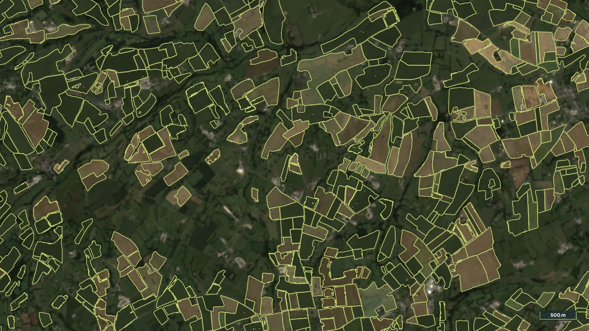
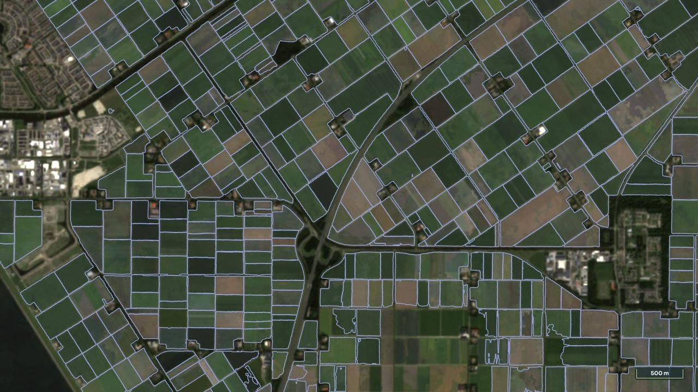
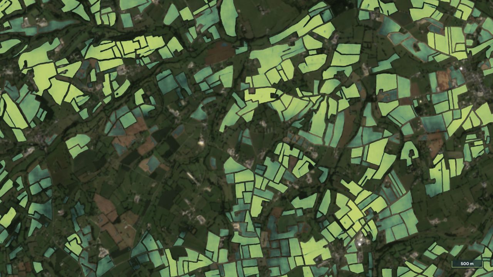
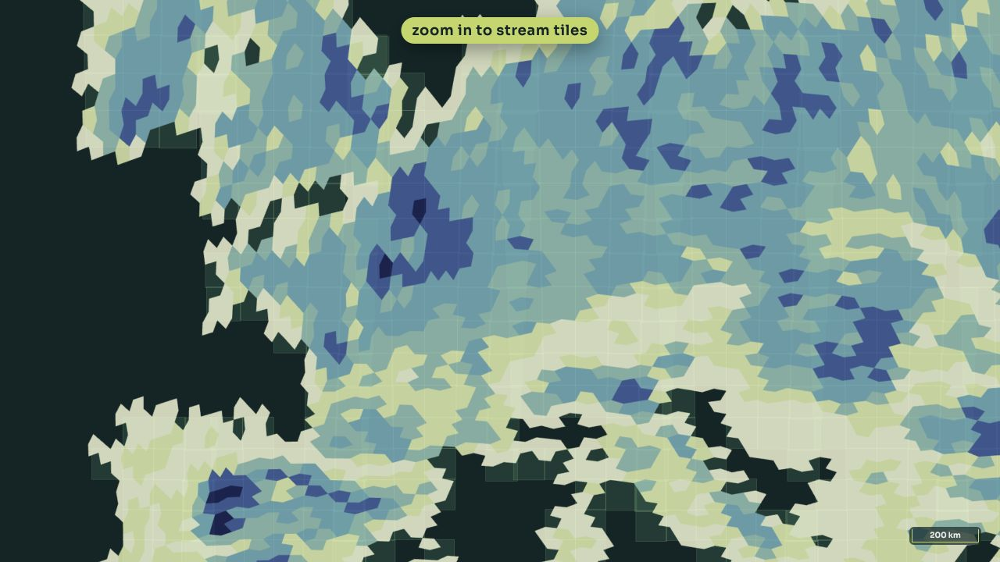
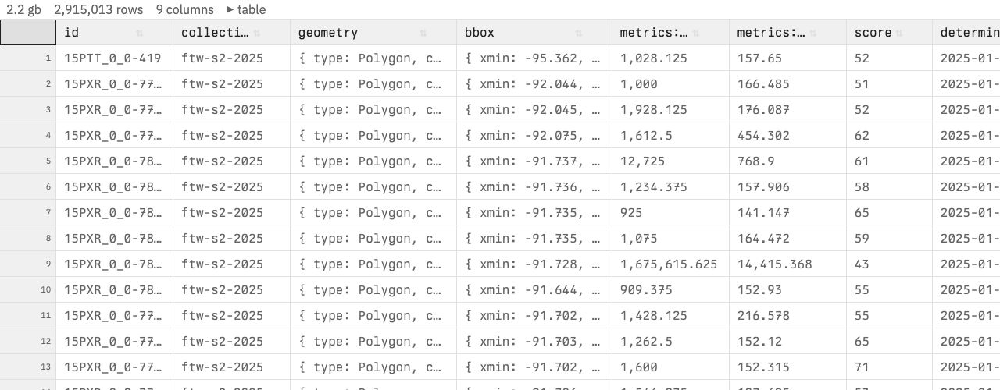
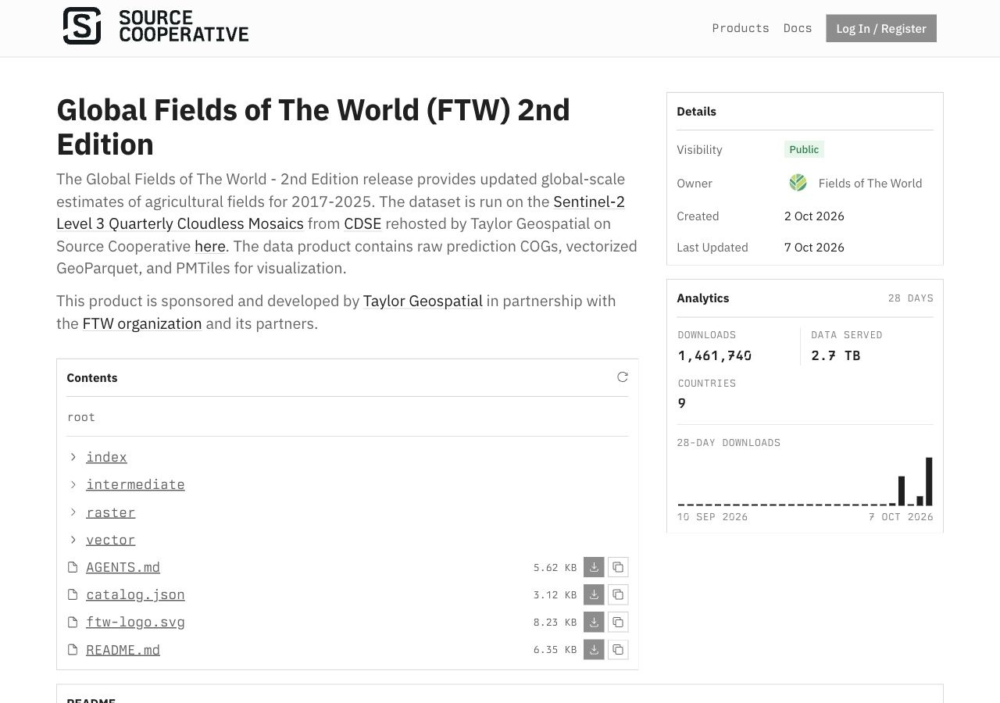
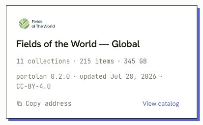

## Mapping the World as a Digital Public Good {#cover .full .tg-dark}

```{=html}
<div class="tg-cover">
<div class="tg-cover-copy">
<p class="eyebrow">CNG Forum 2026 · Snowbird, Utah</p>
<h1>Mapping the World<br>as a Digital<br>Public Good</h1>
<p class="presenter">Isaac Corley<br><span>Director of AI/ML Research · Taylor Geospatial</span></p></div>

</div>
```

::: {.notes}
About 10 seconds. The agenda lists this seven-minute talk on 8 October 2026 at 15:33 America/Denver. Exact title and description are saved in assets/provenance/cng-agenda-2026-10-02.txt. Manual slide advance throughout; every video loops until you advance.
:::

## Taylor Geospatial {#taylor-geospatial .tg-light}

```{=html}
<div class="overview">
<div><p class="eyebrow">For the Digital Public Good</p><h2>Open datasets,<br>models, and tools<br>for mapping the world.</h2>
<p class="overview-body">Research partnerships.<br>Global maps people can reuse.<br>Shared ways to evaluate them.</p></div>
<div class="overview-map"><p>Today’s main example<br><strong>Global Fields of The World · 2nd edition</strong></p></div>
</div>
```

::: {.notes}
About 30 seconds. Taylor Geospatial is a nonprofit working with research and application partners on open geospatial AI. The focus today is what people can use: data, models, and tools. Most of the talk is a preview of the second global FTW map edition. Sources: https://taylorgeospatial.org/about-us/ and the CNG agenda. Avoid introducing Taylor Geospatial as Taylor Geospatial Institute.
:::

## Features, benchmarks, and shared evaluation {#research .tg-light}

```{=html}
<div class="research-overview">
<div class="research-projects"><article><h3>Features of The World</h3><p>Extending the mapping work to roads,<br>buildings, solar panels, and trees.</p><small>Active research</small></article>
<article><h3>Benchmarks of The World</h3><p>Shared evaluation of model quality,<br>geographic generalization, and compute.</p><small>Research and evaluation tools</small></article></div>
<div class="paper"><p class="eyebrow">Accepted at NeurIPS 2026</p><h3>No One Knows the State of the Art in Geospatial Foundation Models</h3><p>Shared protocols and reproducible comparisons<br>for choosing models people can use.</p><a href="https://arxiv.org/abs/2605.12678">Corley et al. · arXiv:2605.12678</a></div>
</div>
```

::: {.notes}
About 50 seconds. Briefly mention the broader work together on this one slide. Features of The World is extending feature mapping beyond fields. Benchmarks of The World concerns useful, comparable model evaluation. The position paper argues for shared evaluation protocols and reproducible comparisons; NeurIPS acceptance was confirmed by Isaac for this talk. Do not quote numerical audit results from the older preprint while revisions are in progress. Sources: https://taylorgeospatial.org/innovation-program/features-of-the-world/ ; https://taylorgeospatial.org/innovation-program/benchmarks-of-the-world/ ; https://arxiv.org/abs/2605.12678.
:::

## Global FTW · 2nd edition {#ftw-preview .full}

```{=html}
<div class="image-slide">
<div class="image-head"><h2>Global FTW · 2nd edition</h2><p>Sneak peek · annual probabilities, 2017–2025 · field polygons</p></div>
<div class="image-credit">Sentinel-2 inputs at 10 m · prediction grid at 2.5 m · selected qualitative examples · FTW / Copernicus / CDSE / Source Cooperative</div></div>
```

::: {.notes}
About 25 seconds. Fields of The World is an open ecosystem of data, models, and tools. This section previews the second global map edition, separate from benchmark-dataset versioning. The annual raster series covers 2017 through 2025. The 2.5 m output grid comes from 10 m Sentinel-2 inputs. Edition comparisons use the same imagery, camera, and line styling; archive simplification and extraction also affect their appearance. These examples do not establish global accuracy. Source: preview catalog README.
:::

## Brazil · large fields {#brazil-editions .full}

```{=html}
<div class="film"><video muted loop playsinline data-autoplay preload="metadata" poster="assets/media/brazil-editions-poster.jpg" aria-label="Sorriso, Brazil: Large fields · 2025"><source src="assets/media/brazil-editions.mp4" type="video/mp4"></video></div>
```

::: {.notes}
About 12 seconds, one loop. The roads and field edges make the outline comparison easy to follow. Both are 2025 maps over the same Q3 mosaic. Camera: -12.58, -55.72; zoom 13; Q3. Source and capture details: MEDIA.md and assets/scenes.json.
:::

## Netherlands · dense fields {#netherlands-editions .full}

```{=html}
<div class="film"><video muted loop playsinline data-autoplay preload="metadata" poster="assets/media/netherlands-editions-poster.jpg" aria-label="Flevoland, Netherlands: Dense field network · 2025"><source src="assets/media/netherlands-editions.mp4" type="video/mp4"></video></div>
```

::: {.notes}
About 12 seconds, one loop. Look at the connected field network, the roads and canals, and the boundaries around the settlement. Camera: 52.65, 5.68; zoom 14; Q3. Source and capture details: MEDIA.md and assets/scenes.json.
:::

## United States · mixed field sizes {#usa-editions .full}

```{=html}
<div class="film"><video muted loop playsinline data-autoplay preload="metadata" poster="assets/media/usa-editions-poster.jpg" aria-label="Iowa, United States: Mixed field sizes · 2024"><source src="assets/media/usa-editions.mp4" type="video/mp4"></video></div>
```

::: {.notes}
About 12 seconds, one loop. A 2024 comparison in Iowa, with large fields, smaller fragments, and wooded waterways. Camera: 41.98, -93.72; zoom 13; Q3. Source and capture details: MEDIA.md and assets/scenes.json.
:::

## France · irregular fields {#france-editions .full}

```{=html}
<div class="film"><video muted loop playsinline data-autoplay preload="metadata" poster="assets/media/france-editions-poster.jpg" aria-label="Normandy, France: Irregular fields and hedgerows · 2025"><source src="assets/media/france-editions.mp4" type="video/mp4"></video></div>
```

::: {.notes}
About 12 seconds, one loop. Normandy adds small, irregular fields separated by hedgerows. Trace the field edges as the wipe passes. Camera: 48.88, -1.05; zoom 14; Q3. Source and capture details: MEDIA.md and assets/scenes.json.
:::

## South Africa · fields and terrain {#south-africa-editions .full}

```{=html}
<div class="film"><video muted loop playsinline data-autoplay preload="metadata" poster="assets/media/south-africa-editions-poster.jpg" aria-label="Overberg, South Africa: Fields following the terrain · 2025"><source src="assets/media/south-africa-editions.mp4" type="video/mp4"></video></div>
```

::: {.notes}
About 12 seconds, one loop. Overberg fields follow terrain and waterways. The shape and continuity of those boundaries are visible at this scale. Camera: -34.25, 19.5; zoom 13.5; Q3. Source and capture details: MEDIA.md and assets/scenes.json.
:::

## Poland · narrow strip fields {#poland-editions .full}

```{=html}
<div class="film"><video muted loop playsinline data-autoplay preload="metadata" poster="assets/media/poland-editions-poster.jpg" aria-label="Mazovia, Poland: Narrow strip fields · 2025"><source src="assets/media/poland-editions.mp4" type="video/mp4"></video></div>
```

::: {.notes}
About 12 seconds, one loop. A dense strip-field system in Mazovia. Both versions still miss fields; the example shows the different boundary renderings rather than complete recovery. Camera: 52.1, 22.14; zoom 14; Q3. Source and capture details: MEDIA.md and assets/scenes.json.
:::

## France · probability masks and polygons {#france-layers .full}

```{=html}
<div class="film"><video muted loop playsinline data-autoplay preload="metadata" poster="assets/media/france-layers-poster.jpg" aria-label="Normandy, France: Irregular fields and hedgerows · 2025"><source src="assets/media/france-layers.mp4" type="video/mp4"></video></div>
```

::: {.notes}
About 12 seconds, one loop. The COG stores field probability. The PMTiles archive presents extracted polygons. The raster retains low-confidence regions and soft transitions; extraction produces individual geometry. The displayed field ramp starts at 128/255, approximately 0.5. Camera: 48.88, -1.05; zoom 14; Q3. Source and capture details: MEDIA.md and assets/scenes.json.
:::

## France · boundary probabilities and polygons {#france-boundary-layers .full}

```{=html}
<div class="film"><video muted loop playsinline data-autoplay preload="metadata" poster="assets/media/france-boundary-layers-poster.jpg" aria-label="Normandy, France: Boundary probabilities and extracted polygons · 2025"><source src="assets/media/france-boundary-layers.mp4" type="video/mp4"></video></div>
```

::: {.notes}
About 12 seconds, one loop. The second COG band estimates boundary probability. Orange is that raster, with display cutoff 64/255, approximately 0.25. Yellow-green is the PMTiles polygon layer, over the same imagery. Camera: 48.88, -1.05; zoom 14; Q3. Source and capture details: MEDIA.md and assets/scenes.json.
:::

## Netherlands · probability masks and polygons {#netherlands-layers .full}

```{=html}
<div class="film"><video muted loop playsinline data-autoplay preload="metadata" poster="assets/media/netherlands-layers-poster.jpg" aria-label="Flevoland, Netherlands: Dense rectangular fields · 2025"><source src="assets/media/netherlands-layers.mp4" type="video/mp4"></video></div>
```

::: {.notes}
About 12 seconds, one loop. The same dense field network in two representations. The mask is useful for inspecting the model output; the polygons are useful for browsing and per-field analysis. Camera: 52.65, 5.68; zoom 14; Q3. Source and capture details: MEDIA.md and assets/scenes.json.
:::

## South Africa · probability masks and polygons {#south-africa-layers .full}

```{=html}
<div class="film"><video muted loop playsinline data-autoplay preload="metadata" poster="assets/media/south-africa-layers-poster.jpg" aria-label="Overberg, South Africa: Fields following the terrain · 2025"><source src="assets/media/south-africa-layers.mp4" type="video/mp4"></video></div>
```

::: {.notes}
About 12 seconds, one loop. Here the field probabilities and extracted polygons follow the curved landscape. The lower-confidence interior features remain visible in the raster. Camera: -34.25, 19.5; zoom 13.5; Q3. Source and capture details: MEDIA.md and assets/scenes.json.
:::

## Poland · probability masks and polygons {#poland-layers .full}

```{=html}
<div class="film"><video muted loop playsinline data-autoplay preload="metadata" poster="assets/media/poland-layers-poster.jpg" aria-label="Mazovia, Poland: Narrow strip fields · 2025"><source src="assets/media/poland-layers.mp4" type="video/mp4"></video></div>
```

::: {.notes}
About 12 seconds, one loop. Narrow fields are a different test of the representation. Inspect the probability strips beside the extracted polygons; do not describe this as complete small-field detection. Camera: 52.1, 22.14; zoom 14; Q3. Source and capture details: MEDIA.md and assets/scenes.json.
:::

## Egypt · irrigation expansion {#egypt-change .full}

```{=html}
<div class="film"><video muted loop playsinline data-autoplay preload="metadata" poster="assets/media/egypt-change-poster.jpg" aria-label="Toshka, Egypt: Expansion of circular irrigation fields"><source src="assets/media/egypt-change.mp4" type="video/mp4"></video></div>
```

::: {.notes}
About 12 seconds, one loop. Now switch from comparing editions to comparing years. New circular irrigation fields are visible between the 2017 and 2025 Q3 mosaics in Toshka. These are dated satellite backgrounds, not a model-derived change map. Camera: 22.7, 31.21; zoom 12.6; Q3. Source and capture details: MEDIA.md and assets/scenes.json.
:::

## Egypt · another irrigation scheme {#delta-change .full}

```{=html}
<div class="film"><video muted loop playsinline data-autoplay preload="metadata" poster="assets/media/delta-change-poster.jpg" aria-label="Western Desert, Egypt: New centre-pivot fields west of the Nile Delta"><source src="assets/media/delta-change.mp4" type="video/mp4"></video></div>
```

::: {.notes}
About 12 seconds, one loop. Another view west of the Nile Delta. New centre-pivot field patterns and associated access infrastructure are visible in 2025. This is a different location from Toshka, with the same quarter and camera in both years. Camera: 30.32, 29.5; zoom 12.5; Q3. Source and capture details: MEDIA.md and assets/scenes.json.
:::

## Bolivia · new field blocks {#bolivia-change .full}

```{=html}
<div class="film"><video muted loop playsinline data-autoplay preload="metadata" poster="assets/media/bolivia-change-poster.jpg" aria-label="Santa Cruz, Bolivia: New field blocks at the agricultural edge"><source src="assets/media/bolivia-change.mp4" type="video/mp4"></video></div>
```

::: {.notes}
About 12 seconds, one loop. At the agricultural edge in Santa Cruz, look near the centre and upper-left for blocks that were wooded in 2017 and have field patterns in 2025. This illustrates a place to investigate agricultural expansion; no area total or cause is inferred. Camera: -16.97, -62.12; zoom 12.4; Q3. Source and capture details: MEDIA.md and assets/scenes.json.
:::

## Paraguay · new clearings {#paraguay-change .full}

```{=html}
<div class="film"><video muted loop playsinline data-autoplay preload="metadata" poster="assets/media/paraguay-change-poster.jpg" aria-label="Chaco, Paraguay: New rectangular clearings within a managed landscape"><source src="assets/media/paraguay-change.mp4" type="video/mp4"></video></div>
```

::: {.notes}
About 12 seconds, one loop. Several rectangular clearings appear within the Chaco landscape. Describe the visible geometry and clearing, without assuming every clearing is cropland; pasture and other uses need reference data. Camera: -22.45, -60.2; zoom 12.7; Q3. Source and capture details: MEDIA.md and assets/scenes.json.
:::

## India · urban growth {#india-change .full}

```{=html}
<div class="film"><video muted loop playsinline data-autoplay preload="metadata" poster="assets/media/india-change-poster.jpg" aria-label="Hyderabad, India: Urban growth along the western edge"><source src="assets/media/india-change.mp4" type="video/mp4"></video></div>
```

::: {.notes}
About 12 seconds, one loop. Hyderabad’s western edge shows new buildings and road networks. Q1 is used in both years because Q3 had cloud gaps. This is visible urban expansion, without a claim that all affected land was cultivated. Camera: 17.43, 78.3; zoom 13; Q1. Source and capture details: MEDIA.md and assets/scenes.json.
:::

## Brazil · fields at the urban edge {#brazil-change .full}

```{=html}
<div class="film"><video muted loop playsinline data-autoplay preload="metadata" poster="assets/media/brazil-change-poster.jpg" aria-label="Sorriso, Brazil: Urban growth along the agricultural edge"><source src="assets/media/brazil-change.mp4" type="video/mp4"></video></div>
```

::: {.notes}
About 12 seconds, one loop. In Sorriso, new streets and buildings occupy parts of the agricultural edge. This is the input imagery for the next slide. Camera: -12.6, -55.735; zoom 14; Q3. Source and capture details: MEDIA.md and assets/scenes.json.
:::

## Brazil · annual field probabilities {#brazil-predictions .full}

```{=html}
<div class="film"><video muted loop playsinline data-autoplay preload="metadata" poster="assets/media/brazil-predictions-poster.jpg" aria-label="Sorriso, Brazil: Annual field probability · candidate changes"><source src="assets/media/brazil-predictions.mp4" type="video/mp4"></video></div>
```

::: {.notes}
About 12 seconds, one loop. The same Sorriso location with annual field probabilities. Some changes align with development. Treat differences as candidates to check against imagery, rather than subtracting polygons and declaring confirmed land-use change. Annual IDs are independent. Camera: -12.6, -55.735; zoom 14; Q3. Source and capture details: MEDIA.md and assets/scenes.json.
:::

## Brazil · another growing agricultural town {#primavera-change .full}

```{=html}
<div class="film"><video muted loop playsinline data-autoplay preload="metadata" poster="assets/media/primavera-change-poster.jpg" aria-label="Primavera do Leste, Brazil: New development around an agricultural town"><source src="assets/media/primavera-change.mp4" type="video/mp4"></video></div>
```

::: {.notes}
About 12 seconds, one loop. A second Brazilian city, Primavera do Leste. New development fills out the road network around the town between 2017 and 2025. Camera: -15.565, -54.275; zoom 13.8; Q3. Source and capture details: MEDIA.md and assets/scenes.json.
:::

## Brazil · check probability changes against imagery {#primavera-predictions .full}

```{=html}
<div class="film"><video muted loop playsinline data-autoplay preload="metadata" poster="assets/media/primavera-predictions-poster.jpg" aria-label="Primavera do Leste, Brazil: Annual field probability · compare with the imagery"><source src="assets/media/primavera-predictions.mp4" type="video/mp4"></video></div>
```

::: {.notes}
About 12 seconds, one loop. A useful check: the large field in the northeast exists in both years, but its predicted probability changes substantially. Annual prediction change can come from model response and observations as well as land-use change. The imagery comparison prevents us calling that a newly created field. Camera: -15.565, -54.275; zoom 13.8; Q3. Source and capture details: MEDIA.md and assets/scenes.json.
:::

## COG, GeoParquet, and PMTiles {#formats .tg-light}

```{=html}
<div class="format-maps"><div><p><strong>COG</strong>Field and boundary probabilities</p></div><div><p><strong>PMTiles</strong>Regional summaries and field polygons</p></div></div>
<p class="format-table-label"><strong>GeoParquet</strong> · Geometry and per-field attributes</p>

<p class="format-note">Open files over HTTPS · bring them into your own analysis</p>
```

::: {.notes}
About 30 seconds. These are three views of reusable data: probabilities in cloud-optimized GeoTIFF, geometry and attributes in GeoParquet, and fast browsing in PMTiles. The screenshots are the actual preview data. The field score is not calibrated accuracy. Raster years span 2017–2025; the vector publication is still being completed, so do not claim all nine vector years are ready. Source: preview catalog metadata.
:::

## Source Cooperative and Portolan {#distribution .tg-light}

```{=html}
<div class="distribution">
<div><h3>Source Cooperative</h3><p>Hosts the data and documentation.</p></div>
<div><h3>Portolan</h3><p>Catalog discovery through STAC<br>and cloud-optimized files.</p><p class="small">Thank you to the Portolan community.</p></div>
</div>
<p class="source-note">Preview on Source Cooperative · Portolan listing shown is the existing Global FTW catalog</p>
```

::: {.notes}
About 20 seconds. Source Cooperative hosts the files. Portolan makes the catalog part of a wider, documented cloud-native ecosystem. The registry screenshot is the existing FTW catalog, not a claim that the second edition is already registered. This remains a sneak peek; the viewer currently uses the beta path. Sources: https://source.coop/ftw/global-data-beta and https://www.portolan-sdi.org/blog/introducing-portolan.
:::

## Links {#end .tg-dark}

```{=html}
<div class="closing"><h2>Mapping the World<br>as a Digital Public Good</h2><p>Isaac Corley · isaac.corley@taylorgeospatial.org</p><div class="closing-links"><a href="https://fieldsofthe.world/">fieldsofthe.world</a><a href="https://taylorgeospatial.org/innovation-program/">Taylor Geospatial research</a><a href="media.html">All 20 comparison clips</a></div></div>
```

::: {.notes}
About 15 seconds. These are the places to follow the work and access the clips. Leave the slide open for questions. Suggested pacing across the deck totals seven minutes: about 75 percent FTW examples, formats, and access; the remainder Taylor Geospatial context and the other research initiatives. Manual pacing is intentional.
:::
