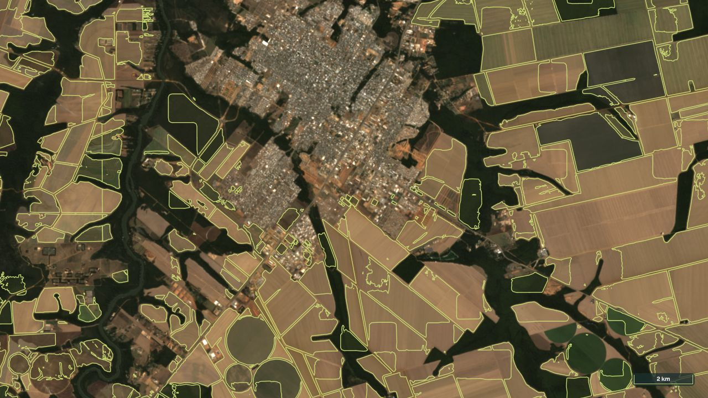
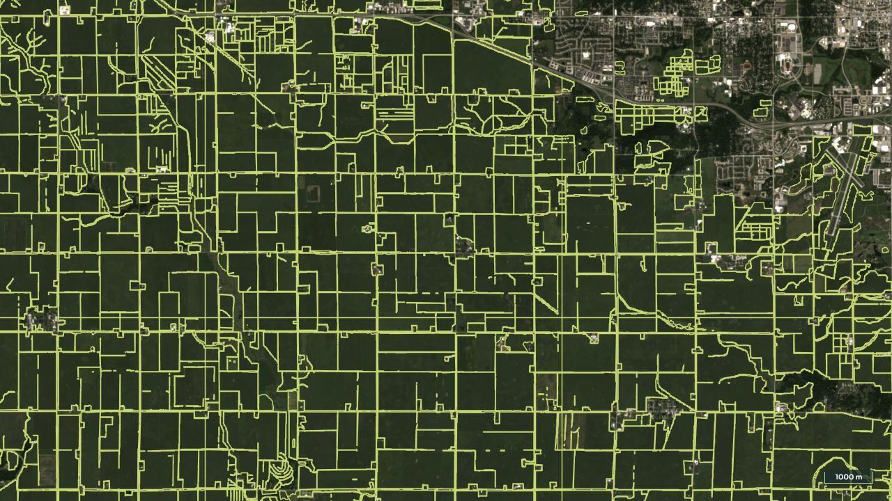
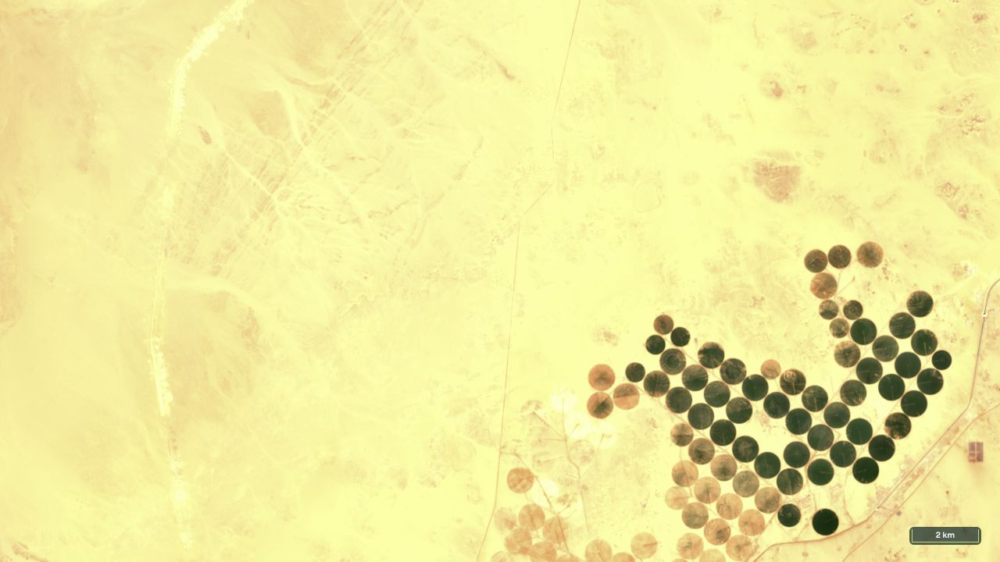
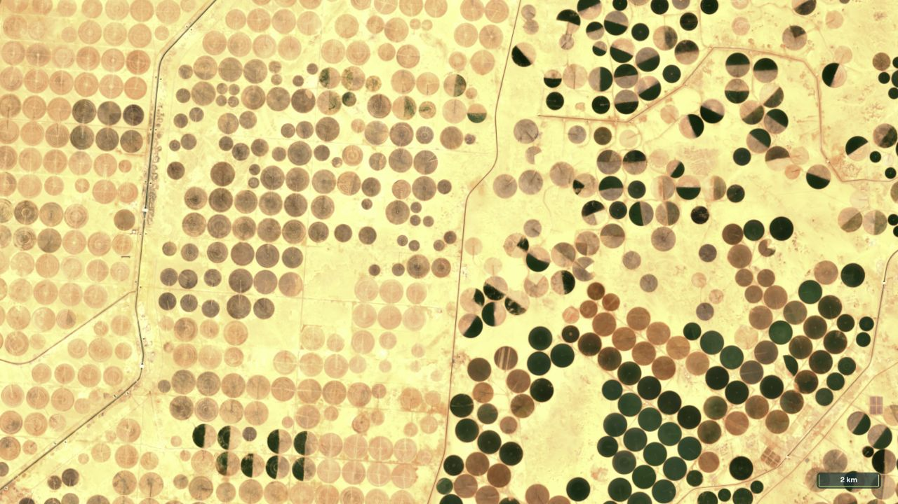
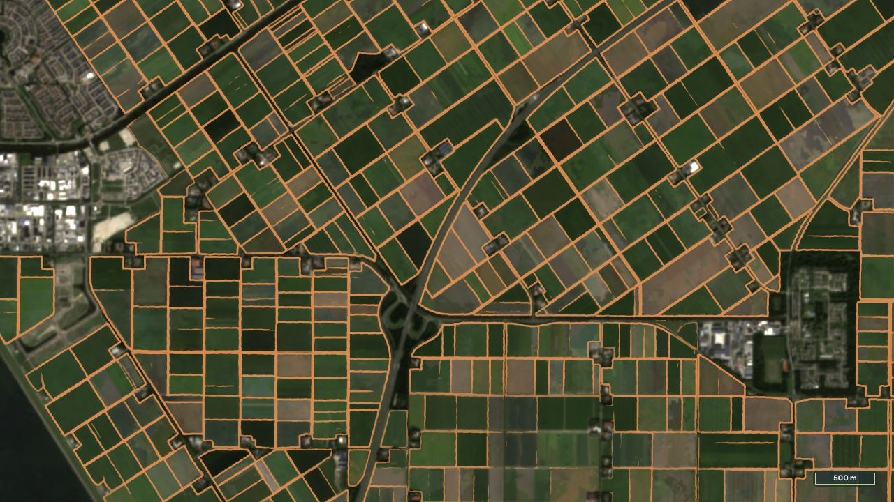

## Global FTW · 2nd edition {#cover .full data-autoslide="0"}

```{=html}
<div class="hero">
  <div class="hero-copy">
    
    <p class="kicker" style="margin-top:60px">CNG lightning talk · Sneak peek</p>
    <h1>Global FTW<br>2nd edition</h1>
    <p class="muted">Mapping agricultural fields<br>as a digital public good</p>
    <p class="byline">Isaac Corley<br><span>Taylor Geospatial</span></p>
  </div>
  
</div>
```

::: {.notes}
Untimed cover. Advance once to begin the five-minute talk. This is a preview of the second global map edition, separate from the FTW benchmark dataset's versioning.
:::

## Agricultural fields, worldwide {#slide-01 .full}

```{=html}
<div class="image-slide">

<div class="image-head"><h2>Agricultural fields, worldwide</h2><p>A shared unit for crop and land-use analysis</p></div>
<div class="image-credit">Flevoland, Netherlands · FTW-2e preview, 2025 · Sentinel-2 Q3 · FTW / Copernicus / CDSE / Source Cooperative</div>
</div>
```

::: {.notes}
Fields are a useful unit for agricultural analysis. This is a sneak peek at the second edition of the Global Fields of The World map. These are predicted field units, not legal parcels. Source: https://fieldsofthe.world/ and the preview catalog README.
:::

## A preview of the second edition {#slide-02}

::: {.two-col}
::: {}
[2017–2025]{.big .key}

Annual field and boundary probabilities

[Sentinel-2 quarterly mosaics<br>10 m inputs · 2.5 m prediction grid]{.small .muted}
:::
::: {}
{.portrait-map fig-alt="Large predicted fields around Sorriso, Brazil"}
:::
:::

[FTW preview catalog · captures made 2 October 2026 · publication still in progress]{.footnote}

::: {.notes}
The preview extends the time axis to nine years. It uses quarterly Sentinel-2 mosaics and publishes probabilities and derived boundaries. Two-point-five metres is the prediction grid, not the native Sentinel-2 resolution. Source: assets/provenance/catalog-readme-2026-10-02.md.
:::

## The original map {#slide-03 .full}

```{=html}
<div class="image-slide">
<div class="image-head"><h2>The original map</h2><p>Watch the closely spaced edges and narrow slivers</p></div>
<div class="image-credit">Iowa, United States · Original FTW alpha, 2024 · Same symbology used in the following comparisons</div></div>
```

::: {.notes}
The original global map was a starting point. In this Iowa example, closely spaced outlines and narrow slivers make the geometry difficult to use. Let's compare the editions at exactly the same locations and dates.
:::

## Brazil · large fields {#slide-04 .full}

```{=html}
<div class="film"><video muted loop playsinline data-autoplay preload="metadata" poster="assets/media/brazil-editions-poster.jpg" aria-label="Sorriso, Brazil: original FTW alpha versus second edition, 2025"><source src="assets/media/brazil-editions.mp4" type="video/mp4"></video></div>
```

::: {.notes}
Here is Sorriso in Brazil, with large fields and an urban edge. The second edition changes both the coverage and geometry. These are selected qualitative examples, not a global accuracy evaluation. Exact camera and source URLs: assets/scenes.json and MEDIA.md.
:::

## Netherlands · dense fields {#slide-05 .full}

```{=html}
<div class="film"><video muted loop playsinline data-autoplay preload="metadata" poster="assets/media/netherlands-editions-poster.jpg" aria-label="Flevoland, Netherlands: original FTW alpha versus second edition, 2025"><source src="assets/media/netherlands-editions.mp4" type="video/mp4"></video></div>
```

::: {.notes}
In the Netherlands, the field network is denser. Watch the long diagonal boundaries and the joins between neighbouring fields. The same line color, width, image, and camera keep the comparison focused on geometry.
:::

## United States · mixed field sizes {#slide-06 .full}

```{=html}
<div class="film"><video muted loop playsinline data-autoplay preload="metadata" poster="assets/media/usa-editions-poster.jpg" aria-label="Iowa, United States: original FTW alpha versus second edition, 2024"><source src="assets/media/usa-editions.mp4" type="video/mp4"></video></div>
```

::: {.notes}
Back in Iowa, compare the long field edges and small fragments. This example uses 2024; Brazil and the Netherlands use 2025. We still need regional validation, particularly for small fields and places outside the training distribution.
:::

## Annual maps open up change analysis {#slide-07}

```{=html}
<div class="timeline"><span>2017</span><span>2018</span><span>2019</span><span>2020</span><span>2021</span><span>2022</span><span>2023</span><span>2024</span><span>2025</span></div>
<div class="paired"><div><p>Where were fields?</p></div><div><p>Where are they now?</p></div></div>
```

[Annual predictions are independent; field IDs do not track the same field across years.]{.footnote}

::: {.notes}
The time dimension opens up another set of applications. Where has agriculture expanded? Where have fields been converted? Each year is predicted independently, so tracking change needs spatial comparisons, not matching field IDs. Source: preview README, Limitations.
:::

## Egypt · irrigation expansion {#slide-08 .full}

```{=html}
<div class="film"><video muted loop playsinline data-autoplay preload="metadata" poster="assets/media/egypt-change-poster.jpg" aria-label="Sentinel-2 Q3 imagery of Toshka, Egypt, in 2017 and 2025"><source src="assets/media/egypt-change.mp4" type="video/mp4"></video></div>
```

::: {.notes}
This is Toshka, Egypt. Circular irrigation fields spread across land that was largely bare in 2017. Both frames are third-quarter Sentinel-2 composites. The imagery demonstrates expansion; it is not a validated estimate of added cultivated area. Context: https://science.nasa.gov/earth/earth-observatory/agriculture-in-egypts-western-desert-144383/.
:::

## Brazil · urban growth {#slide-09 .full}

```{=html}
<div class="film"><video muted loop playsinline data-autoplay preload="metadata" poster="assets/media/brazil-change-poster.jpg" aria-label="Sentinel-2 Q3 imagery showing Sorriso's urban edge in 2017 and 2025"><source src="assets/media/brazil-change.mp4" type="video/mp4"></video></div>
```

::: {.notes}
Here the application is field conversion at an urban edge. Around Sorriso, new streets and buildings extend into previously open fields. Watch the upper half and the central road corridor. Again, the seasons and camera are matched.
:::

## Brazil · annual predictions {#slide-10 .full}

```{=html}
<div class="film"><video muted loop playsinline data-autoplay preload="metadata" poster="assets/media/brazil-predictions-poster.jpg" aria-label="FTW annual field probability in Sorriso in 2017 and 2025"><source src="assets/media/brazil-predictions.mp4" type="video/mp4"></video></div>
```

::: {.notes}
The annual predictions flag candidate changes in that same view. Some follow the expanding urban edge; other differences reflect crops, imagery, or model error. Use this as a screening layer, then check the underlying observations.
:::

## How to use a change signal {#slide-11}

::: {.rows}
::: {.row}
**Compare** [Match place, season, and spatial support]{.small}
:::
::: {.row}
**Check** [Inspect imagery and local reference data]{.small}
:::
::: {.row}
**Measure** [Separate persistent change from model error]{.small}
:::
:::

[Predicted field units · independent annual outputs · uncalibrated model scores]{.caption}

::: {.notes}
A useful workflow is to compare the annual maps, inspect the imagery, and validate persistent changes before measuring them. Seasonality and errors matter. The polygons describe remote-sensing field units; they do not establish land ownership.
:::

## Three formats, three jobs {#slide-12}

::: {.rows}
::: {.row}
**COG** [Read field and boundary probabilities]{.small}
:::
::: {.row}
**GeoParquet** [Query, filter, and analyse field polygons]{.small}
:::
::: {.row}
**PMTiles** [Explore the map in a browser]{.small}
:::
:::

[All served as files over HTTPS from Source Cooperative]{.caption}

::: {.notes}
For this community, the delivery is as important as the map. The same work is available as cloud-optimized rasters, analytical vectors, and browser-friendly vector tiles. You can choose the representation that fits your task. Source: live preview catalog.
:::

## COG · probabilities before polygons {#slide-13}

::: {.two-col}
::: {}
Two bands

[Field interior<br>Field boundary]{.big .key style="font-size:52px"}

[2.5 m prediction grid<br>10 m Sentinel-2 inputs<br>Annual COGs, 2017–2025]{.small .muted}
:::
::: {}
{.portrait-map fig-alt="FTW boundary probability rendered from a Cloud-Optimized GeoTIFF"}
:::
:::

[FTW preview raster collection · uint8 probabilities scaled by 1/255 · CC BY 4.0]{.footnote}

::: {.notes}
The COG keeps the field-interior and boundary probabilities, before polygon extraction. That lets people inspect or reuse the model output. The grid is two-point-five metres, derived from ten-metre Sentinel-2 inputs. Source: preview raster README and live viewer.
:::

## GeoParquet · query the fields {#slide-14}

{.wide-shot fig-alt="Actual GeoParquet table preview on Source Cooperative, including geometry, bounding boxes, areas and perimeters"}

[Geometry · bounding box · area · perimeter · model score]{.caption}

[Live file preview · vector/2025/zone=15/utm15.parquet · fiboa / vecorel schema]{.footnote}

::: {.notes}
GeoParquet provides geometry and attributes for analysis, including bounding boxes, area, perimeter, and a model score. This is the actual table preview from Source Cooperative. The score is a model probability summary, not calibrated accuracy. Source: vector/2025/collection.json.
:::

## PMTiles · browse the map {#slide-15 .full}

```{=html}
<div class="image-slide">
<div class="image-head"><h2>PMTiles · browse the map</h2><p>Regional aggregates → individual field polygons</p></div>
<div class="coverage-legend">Predicted field coverage (%)<div class="ramp"><span style="background:#ffffd9"></span><span style="background:#edf8b1"></span><span style="background:#7fcdbb"></span><span style="background:#41b6c4"></span><span style="background:#225ea8"></span><span style="background:#081d58"></span></div><div class="ticks"><span>0</span><span>2</span><span>10</span><span>25</span><span>50</span><span>75+</span></div></div>
<div class="image-credit">2025 preview · PMTiles coverage (%) · A5 cells at zooms 0–8, field polygons from zoom 9 · FTW / Source Cooperative</div></div>
```

::: {.notes}
PMTiles supports exploration from regional summaries down to individual polygons. The current archives switch from A5 cell aggregates to fields at zoom nine. The temporary viewer reads the archive directly; it isn't the lasting interface to the data. Source: vector/2025/collection.json and viewer config.
:::

## Source Cooperative · distribution {#slide-16}

::: {.two-col}
::: {}
[Hosted on<br>Source Cooperative]{.big style="font-size:57px"}

[HTTPS access<br>Cloud-optimized files<br>CC BY 4.0 predictions]{.muted}
:::
::: {}
{.portrait-map style="object-position:left top" fig-alt="Source Cooperative second-edition preview catalog, marked Unlisted"}
:::
:::

[Preview catalog captured 2 October 2026 · currently unlisted · data path still global-data-beta]{.footnote}

::: {.notes}
Source Cooperative hosts the files and their documentation. The preview is still unlisted, and the viewer currently uses the beta path while publication is being completed. The important part is direct access to reusable data. Source: https://source.coop/ftw/global-data-beta.
:::

## Portolan · discovery and reuse {#slide-17}

::: {.two-col}
::: {}
[Thank you,<br>Portolan]{.big .key}

[Open formats<br>STAC metadata<br>Documentation for people<br>and agents]{.muted}
:::
::: {}
{style="width:100%;height:430px;object-fit:contain;background:white" fig-alt="Portolan registry listing the existing Global FTW catalog"}
:::
:::

[portolan-sdi.org · registry screenshot shows the existing Global FTW catalog]{.footnote}

::: {.notes}
A shoutout to Portolan, which brings open formats, STAC metadata, and clear documentation together. Global FTW is already part of that ecosystem. This registry screenshot is the existing edition; the second edition remains a preview. Source: https://www.portolan-sdi.org/blog/introducing-portolan.
:::

## Use the files in your own tools {#slide-18}

::: {.two-col}
::: {}
[One catalog URL]{.big .key style="font-size:61px"}

[Find the collection.<br>Read its metadata.<br>Open the data.]{.muted}
:::
::: {}
```text
catalog.json
├── README.md
├── AGENTS.md
├── raster/
│   └── 2025/… .tif
└── vector/
    └── 2025/
        ├── fields-2025.pmtiles
        └── zone=15/utm15.parquet
```
:::
:::

[Simplified tree of the live preview catalog · open with GIS tools, Python, or DuckDB]{.footnote}

::: {.notes}
The deliverable is a catalog of documented files. People can bring those files into their own tools and build interfaces we haven't imagined. That is the connection to digital public goods: shared data, open formats, and reusable infrastructure.
:::

## Help us test the preview {#slide-19}

[Where does it miss fields?]{.big}

[Which changes matter<br>in your work?]{.big .key}

[Regional checks · difficult field systems · real use cases]{.caption}

::: {.notes}
We'd welcome regional checks, difficult examples, and applications. The selected comparisons are promising, but don't establish performance everywhere. Small fields remain an important testing priority. Tell us what you need from the next global map.
:::

## Built with the community {#slide-20}

::: {.two-col}
::: {}
{width=300 fig-alt="Fields of The World"}

[Taylor Geospatial<br>FTW collaborators and partners]{.small}

[Copernicus / CDSE<br>Source Cooperative<br>Portolan]{.muted}
:::
::: {.links}
[Global FTW · 2nd edition]{.big .key style="font-size:59px"}

[Sneak peek · feedback welcome]{.caption}

[fieldsofthe.world](https://fieldsofthe.world/)

[Source Cooperative preview](https://source.coop/ftw/global-data-beta)

[portolan-sdi.org](https://www.portolan-sdi.org/)
:::
:::

::: {.notes}
Thanks to the FTW community and partners, Taylor Geospatial, Copernicus and CDSE, Source Cooperative, and Portolan. This is a sneak peek, and we'd love your feedback. The data and tools are linked here.
:::

## Thank you {#end data-autoslide="0"}

::: {.thanks}
```{=html}
<h2>Thank you</h2>
```

Isaac Corley · Taylor Geospatial

[isaac.earth](https://isaac.earth/) · [fieldsofthe.world](https://fieldsofthe.world/)
:::
