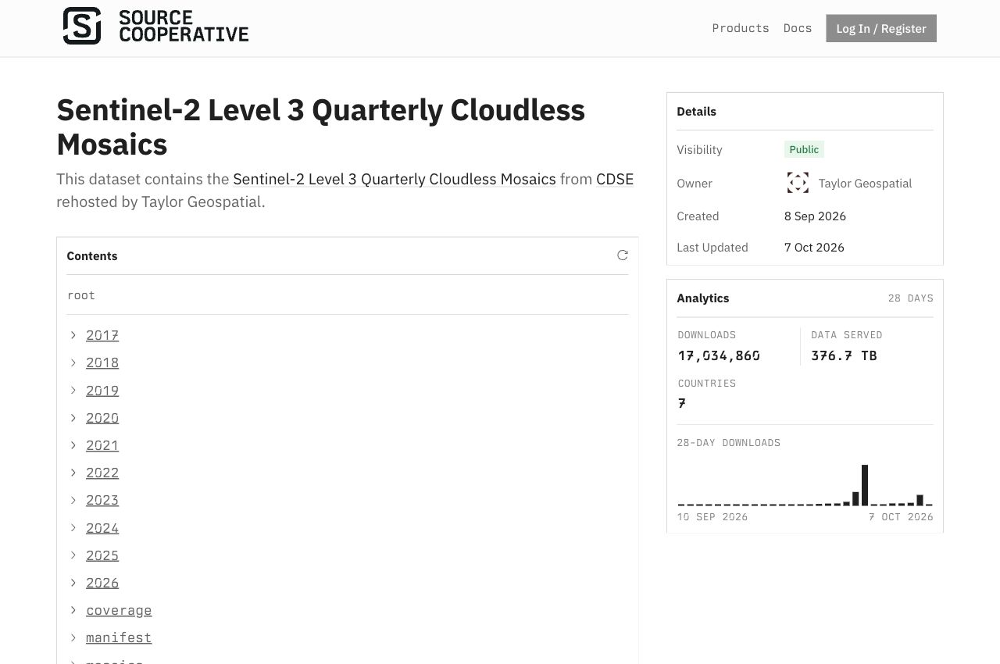
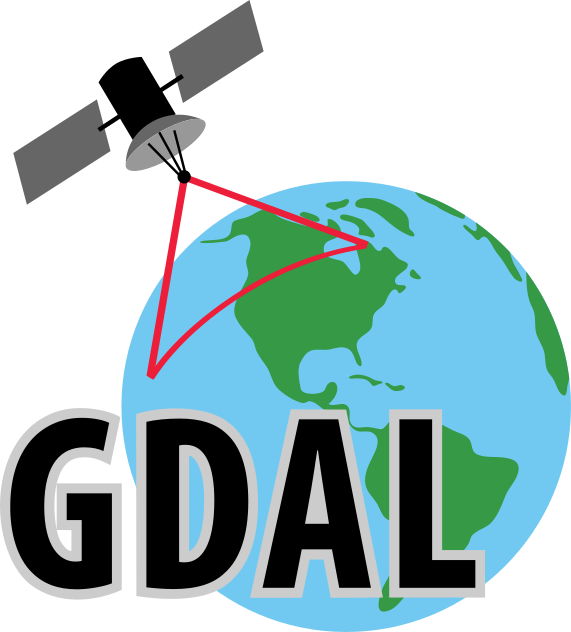

## Mapping the World as a Digital Public Good {#cover .full .tg-dark data-autoslide="15000"}

```{=html}
<div class="tg-cover">
<div class="tg-cover-copy">
<p class="eyebrow">CNG Forum 2026 · Snowbird, Utah</p>
<h1>Mapping the World<br>as a Digital Public Good</h1>
<p class="presenter">Isaac Corley<br><span>Director of AI/ML Research · Taylor Geospatial</span></p></div>

</div>
```

::: {.notes}
About 15 seconds.
CNG plenary lightning talks use 20 slides at 15 seconds each.
The agenda entry begins on 8 October 2026 at 15:33 America/Denver.
The seven-minute agenda slot allows five minutes for the talk.
Timing starts when the deck opens.
Use ?autoSlide=0 for manual rehearsal.
Every video loops until the slide advances.
:::

## Taylor Geospatial {#taylor-geospatial .tg-light data-autoslide="15000"}

```{=html}
<div class="overview">
<div><p class="eyebrow">Taylor Geospatial</p><h2>Open Maps, Embeddings<br>and Geospatial AI Research</h2>
<p class="overview-body">We develop open datasets, models, and tools with research and application partners.</p>
<ol class="talk-route"><li><strong>Field mapping</strong><span>Global FTW and agricultural change</span></li><li><strong>Geographic embeddings</strong><span>MIND the Gap and Planetary Feature Fields</span></li><li><strong>Model evaluation</strong><span>Comparable tests across tasks and regions</span></li></ol></div>
<div class="overview-map"><p>Predicted field boundaries in Flevoland, Netherlands.<br><span>Global FTW · 2nd edition · 2025</span></p></div>
</div>
```

::: {.notes}
About 15 seconds.
Taylor Geospatial is a nonprofit working with research and application partners on open geospatial AI.
We develop datasets, models, and tools for mapping and model evaluation.
Most of this talk covers FTW field maps and agricultural change.
MIND and PFFs study geographic embeddings, and our position paper examines model evaluation.
Sources: https://taylorgeospatial.org/about-us/ and the CNG agenda.
:::

## Global FTW · 2nd edition {#ftw-preview .full data-autoslide="15000"}

```{=html}
<div class="image-slide">
<div class="image-head"><h2>Global FTW · 2nd edition</h2><p>Annual field maps · 2017–2025</p></div>
</div>
```

::: {.notes}
About 15 seconds.
FTW maps agricultural fields.
Fields of The World provides open data, models, and tools for agricultural field mapping.
The global maps and benchmark dataset have separate edition numbers.
The annual raster series covers 2017 through 2025.
The 2.5 m output grid comes from 10 m Sentinel-2 inputs.
Edition comparisons use the same imagery, camera, and line styling.
Archive simplification and extraction also affect the rendered boundaries.
These selected examples do not establish global accuracy.
Source: preview catalog README.
Reference: Sentinel-2 inputs at 10 m · prediction grid at 2.5 m · selected qualitative examples · FTW / Copernicus / CDSE / Source Cooperative
:::

## Sentinel-2 quarterly mosaics {#mosaics .tg-light .product-detail data-autoslide="15000"}

```{=html}
<div class="product-layout mosaic-layout">
<div><p class="mosaic-years">2017–2026</p><p>We rehosted the Copernicus quarterly mosaics on Source Cooperative.</p><p><strong>10 m · RGB+NIR</strong><br>COGs include overviews for streaming regions and zoom levels over HTTPS.</p><p class="coverage-detail">2026 · Q1/Q2</p></div>
<figure></figure>
</div>
```

::: {.notes}
About 15 seconds.
We rehost the Sentinel-2 quarterly mosaics used in this workflow.
Copernicus produces the mosaics, and Taylor Geospatial hosts a copy.
The 10 m RGB+NIR COGs include overviews, so requests can fetch specific regions and resolutions.
The public README checked on 5 October describes all quarters from 2017 through 2025 and a transferred 2026 Q2 outside the catalog.
It describes Q1 as incomplete, so the 2026 record is partial.
Published quarter manifests record coverage.
Source: https://source.coop/tge-labs/sentinel-2-quarterly-cloudless-mosaics and its public README.
Reference: source.coop/tge-labs/sentinel-2-quarterly-cloudless-mosaics (https://source.coop/tge-labs/sentinel-2-quarterly-cloudless-mosaics) · Copernicus Sentinel data · ESA / Sinergise / CDSE · mirror by Taylor Geospatial
Figure note: Public file access without a CDSE account.
:::

## France · probability masks and polygons {#france-layers .full data-autoslide="15000"}

```{=html}
<div class="film"><video data-autoplay controls muted loop playsinline preload="metadata" poster="assets/media/france-layers-poster.jpg?v=20261006" aria-label="Normandy, France: Irregular fields and hedgerows · 2025"><source src="assets/media/france-layers.mp4?v=20261006" type="video/mp4"></video></div>
```

::: {.notes}
About 15 seconds.
The COG stores field probabilities, and the PMTiles archive stores the extracted polygons.
The raster retains low-confidence regions and soft transitions, while extraction produces individual geometries.
The displayed field ramp starts at 128/255, approximately 0.5.
Camera: 48.88, -1.05; zoom 14; Q3.
The following examples compare polygons across field sizes and shapes.
Source and capture details: MEDIA.md and assets/scenes.json.
:::

## Global FTW 1st edition → 2nd edition {#editions-large-dense .paired .tg-light data-autoslide="15000"}

```{=html}
<div class="comparison-pair"><article><h3>Sorriso, Brazil</h3><video data-autoplay controls muted loop playsinline preload="metadata" poster="assets/media/brazil-editions-poster.jpg?v=20261006" aria-label="Sorriso, Brazil · Large fields · 2025"><source src="assets/media/brazil-editions.mp4?v=20261006" type="video/mp4"></video></article><article><h3>Flevoland, Netherlands</h3><video data-autoplay controls muted loop playsinline preload="metadata" poster="assets/media/netherlands-editions-poster.jpg?v=20261006" aria-label="Flevoland, Netherlands · Dense field network · 2025"><source src="assets/media/netherlands-editions.mp4?v=20261006" type="video/mp4"></video></article></div>
```

::: {.notes}
About 15 seconds.
The Brazilian example has large fields, while the Dutch example has a denser field network.
Each pair uses identical imagery and line styling.
The model, extraction, simplification, and publishing steps all affect the boundaries, so these comparisons do not measure model accuracy alone.
Source cameras, dates, and rendering details: MEDIA.md and assets/scenes.json.
Reference: FTW · Sentinel-2 / Copernicus / CDSE · Source Cooperative · Selected qualitative examples
:::

## Mixed and irregular field shapes {#editions-mixed-irregular .paired .tg-light data-autoslide="15000"}

```{=html}
<div class="comparison-pair"><article><h3>Iowa, United States</h3><video data-autoplay controls muted loop playsinline preload="metadata" poster="assets/media/usa-editions-poster.jpg?v=20261006" aria-label="Iowa, United States · Mixed field sizes · 2024"><source src="assets/media/usa-editions.mp4?v=20261006" type="video/mp4"></video></article><article><h3>Normandy, France</h3><video data-autoplay controls muted loop playsinline preload="metadata" poster="assets/media/france-editions-poster.jpg?v=20261006" aria-label="Normandy, France · Irregular fields and hedgerows · 2025"><source src="assets/media/france-editions.mp4?v=20261006" type="video/mp4"></video></article></div>
```

::: {.notes}
About 15 seconds.
Iowa has larger fields and wooded waterways, while Normandy has smaller irregular parcels.
Source cameras, dates, and rendering details: MEDIA.md and assets/scenes.json.
Reference: FTW · Sentinel-2 / Copernicus / CDSE · Source Cooperative · Selected qualitative examples
:::

## Fields along terrain and narrow strips {#editions-terrain-strips .paired .tg-light data-autoslide="15000"}

```{=html}
<div class="comparison-pair"><article><h3>Overberg, South Africa</h3><video data-autoplay controls muted loop playsinline preload="metadata" poster="assets/media/south-africa-editions-poster.jpg?v=20261006" aria-label="Overberg, South Africa · Fields following the terrain · 2025"><source src="assets/media/south-africa-editions.mp4?v=20261006" type="video/mp4"></video></article><article><h3>Mazovia, Poland</h3><video data-autoplay controls muted loop playsinline preload="metadata" poster="assets/media/poland-editions-poster.jpg?v=20261006" aria-label="Mazovia, Poland · Narrow strip fields · 2025"><source src="assets/media/poland-editions.mp4?v=20261006" type="video/mp4"></video></article></div>
```

::: {.notes}
About 15 seconds.
Field shapes vary across these farming systems, and both versions still miss fields in Poland.
The edition comparisons hold imagery fixed.
The year-to-year comparisons change both the maps and imagery.
Source cameras, dates, and rendering details: MEDIA.md and assets/scenes.json.
Reference: FTW · Sentinel-2 / Copernicus / CDSE · Source Cooperative · Selected qualitative examples
:::

## New field blocks {#change-new-fields .paired .tg-light data-autoslide="15000"}

```{=html}
<div class="comparison-pair"><article><h3>Matopiba, Brazil</h3><video data-autoplay controls muted loop playsinline preload="metadata" poster="assets/media/matopiba-change-poster.jpg?v=20261003b" aria-label="Matopiba, Brazil · New rectangular field blocks"><source src="assets/media/matopiba-change.mp4?v=20261003b" type="video/mp4"></video></article><article><h3>Masindi, Uganda</h3><video data-autoplay controls muted loop playsinline preload="metadata" poster="assets/media/masindi-change-poster.jpg?v=20261003b" aria-label="Masindi, Uganda · New gridded fields"><source src="assets/media/masindi-change.mp4?v=20261003b" type="video/mp4"></video></article></div>
```

::: {.notes}
About 15 seconds.
Both the imagery and annual outlines show new field blocks.
The viewer uses 2018 as the baseline because the 2017 predictions miss fields in some regions.
Matopiba uses Q3 in both years to avoid cloud gaps in the viewer’s Q1 example.
The examples do not estimate crop types or hectare totals.
Source cameras, dates, and rendering details: MEDIA.md and assets/scenes.json.
Reference: FTW · Sentinel-2 / Copernicus / CDSE · Source Cooperative · Selected qualitative examples
:::

## Expansion of irrigated fields {#change-irrigation .paired .tg-light data-autoslide="15000"}

```{=html}
<div class="comparison-pair"><article><h3>Ili Valley, China</h3><video data-autoplay controls muted loop playsinline preload="metadata" poster="assets/media/ili-change-poster.jpg?v=20261003b" aria-label="Ili Valley, China · New fields across the valley floor"><source src="assets/media/ili-change.mp4?v=20261003b" type="video/mp4"></video></article><article><h3>Kura lowland, Azerbaijan</h3><video data-autoplay controls muted loop playsinline preload="metadata" poster="assets/media/kura-change-poster.jpg?v=20261003b" aria-label="Kura lowland, Azerbaijan · New irrigated field patterns"><source src="assets/media/kura-change.mp4?v=20261003b" type="video/mp4"></video></article></div>
```

::: {.notes}
About 15 seconds.
Irrigated field patterns cover more ground in the later images.
Vegetation, access tracks, and field geometry help interpret the predictions.
The images alone cannot establish water use or why the land changed.
Source cameras, dates, and rendering details: MEDIA.md and assets/scenes.json.
Reference: FTW · Sentinel-2 / Copernicus / CDSE · Source Cooperative · Selected qualitative examples
:::

## Changes in field layout and crop activity {#change-layout-activity .paired .tg-light data-autoslide="15000"}

```{=html}
<div class="comparison-pair"><article><h3>West Bahia, Brazil</h3><video data-autoplay controls muted loop playsinline preload="metadata" poster="assets/media/bahia-layout-change-poster.jpg?v=20261003b" aria-label="West Bahia, Brazil · Rectangular fields replaced by center pivots"><source src="assets/media/bahia-layout-change.mp4?v=20261003b" type="video/mp4"></video></article><article><h3>Al-Jawf, Saudi Arabia</h3><video data-autoplay controls muted loop playsinline preload="metadata" poster="assets/media/al-jawf-change-poster.jpg?v=20261003b" aria-label="Al-Jawf, Saudi Arabia · Fewer green center pivots in 2025"><source src="assets/media/al-jawf-change.mp4?v=20261003b" type="video/mp4"></video></article></div>
```

::: {.notes}
About 15 seconds.
The field layout changes in Bahia, but the land remains agricultural.
In Al-Jawf, many formerly green circles are pale in the later mosaic.
The imagery does not establish whether fields were permanently abandoned or why.
Because predictions are made independently each year and imagery is seasonal, missing polygons do not necessarily mean lost cropland.
Source cameras, dates, and rendering details: MEDIA.md and assets/scenes.json.
Reference: FTW · Sentinel-2 / Copernicus / CDSE · Source Cooperative · Selected qualitative examples
:::

## Tools for large datasets {#processing-tools .tg-light data-autoslide="15000"}

```{=html}
<p class="tools-intro">Converting rasters to polygons, simplifying geometry, and extracting fields slowed processing at global scale.</p>
<div class="processing-tools">
<article><h3 class="tool-brand"></h3><p class="tool-language">Rust core · Python / Shapely</p><p>coarsen reduces vertices while keeping shared field boundaries aligned.</p><a href="https://research.taylorgeospatial.org/coarsen/"></a></article>
<article><h3 class="tool-brand"></h3><p class="tool-language">Rust core · Python / Arrow</p><p>contourrs converts raster regions and contour bands to polygons, with direct Arrow output.</p><a href="https://research.taylorgeospatial.org/contourrs/"></a></article>
<article><h3 class="tool-brand">fbp</h3><p class="tool-language">Field boundary postprocessing</p><p>fbp extracts individual fields from semantic predictions and processes large rasters in windows.</p><a href="https://github.com/fieldsoftheworld/fbp"></a></article>
</div>
```

::: {.notes}
About 15 seconds.
Some processing stages were too slow at this scale, so we built reusable tools.
Coarsen simplifies geometry in Rust while preserving shared boundaries.
Contourrs converts rasters and contours to polygons with Arrow output.
Fbp implements field-instance postprocessing algorithms, including BoundaryVote, through a common interface and processes large rasters in windows.
We developed these tools during the project, but the current standalone versions were not necessarily used to produce the earlier release.
The documentation gives benchmark conditions and limitations because speedups depend on the workload.
Sources checked 5 October 2026: https://research.taylorgeospatial.org/coarsen/ ; https://research.taylorgeospatial.org/contourrs/ ; https://github.com/fieldsoftheworld/fbp.
:::

## COG, GeoParquet, and PMTiles {#formats .tg-light data-autoslide="15000"}

```{=html}
<div class="format-maps"><div><p><strong>COG</strong>Field and boundary probabilities</p></div><div><p><strong>PMTiles</strong>Regional summaries and field polygons</p></div></div>
<p class="format-table-label"><strong>GeoParquet</strong> · Geometry and per-field attributes</p>

```

::: {.notes}
About 15 seconds.
Cloud-optimized GeoTIFFs store probabilities, and GeoParquet stores geometry and attributes.
PMTiles provides fast map browsing.
The screenshots show the preview data.
The field score is not calibrated accuracy.
The current catalog lists raster and vector collections for 2017–2025.
Source: preview catalog metadata.
:::

## Source Cooperative and Portolan {#distribution .tg-light data-autoslide="15000"}

```{=html}
<div class="distribution">
<div><h3>Source Cooperative</h3></div>
<div><h3>Portolan</h3><p class="small">Thank you to the Portolan community.</p></div>
</div>
```

::: {.notes}
About 15 seconds.
Source Cooperative hosts the files and documentation.
Portolan helps people find STAC catalogs and cloud-optimized files.
The current second-edition catalog is linked from https://github.com/fieldsoftheworld/ftw-global-data-catalog.
The viewer now reads the second-edition product at ftw/global-data-2e.
FTW maps fields.
MIND and PFFs study representations that can be reused across products and tasks.
Sources: https://source.coop/ftw/global-data-2e and https://www.portolan-sdi.org/blog/introducing-portolan.
:::

## MIND the Gap {#mind .tg-light .research-detail data-autoslide="15000"}

```{=html}
<p class="research-subtitle">A Geographic Implicit Neural Representation with Adjustable Spatial Scale</p>
<div class="research-detail-layout mind-layout">
<div class="research-copy">
<p>Geographic implicit neural representations (INRs) learn features from coordinates.</p>
<p><strong>MIND</strong> produces reusable location embeddings at coarse and fine scales.
Predictors can choose the spatial detail without retraining the encoder.</p>
<p class="research-release">Model weights and global Zarr embeddings are available on Source Cooperative.</p>
</div>
<figure class="mind-figure"><video data-autoplay controls muted loop playsinline preload="metadata" poster="assets/research/mind-embedding-poster.jpg" aria-label="MIND geographic embedding globe cycling from coarse to fine-grained features"><source src="assets/research/mind-embedding.mp4" type="video/mp4"></video></figure>
</div>
```

::: {.notes}
About 15 seconds.
Geographic INRs learn features from location coordinates.
An embedding represents a location as numbers that can be reused to predict its properties.
MIND learns from several existing representations and arranges its embedding into nested chunks.
Early chunks tend to describe broad geographic variation, while later chunks add finer detail.
A downstream predictor can select or downweight chunks without retraining the geographic encoder.
The globe shows successive 64-dimensional storage chunks, each colored with a separate principal component analysis (PCA).
The colors represent embeddings, so they do not show land-cover classes or change through time.
At inference, the model takes coordinates without a new satellite image of the location.
We release the model and precomputed global embeddings.
PFFs encode several existing Earth-observation products in a compact representation of space and time.
Sources: https://research.taylorgeospatial.org/mind/ and https://arxiv.org/abs/2609.25454.
Reference: Corley et al. (2026) · Paper (https://arxiv.org/abs/2609.25454) · research.taylorgeospatial.org/mind (https://research.taylorgeospatial.org/mind/)
Figure note: The colors show PCA projections of successive embedding chunks.
Each chunk has its own colors, so comparisons should focus on spatial patterns.
:::

## Planetary Feature Fields {#pffs .tg-light .research-detail data-autoslide="15000"}

```{=html}
<p class="research-subtitle">Planetary Feature Fields are Scalable Earth Representations</p>
<div class="research-detail-layout pff-layout">
<div class="research-copy">
<p><strong>PFFs</strong> encode satellite observations, embeddings, and map products in a model queried by location and time.</p>
<p>A shared neural field uses a small decoder to reconstruct each product.</p>
<p class="research-result">In the paper’s tests, reconstructed features retain roughly <strong>90% or more</strong> of the original downstream performance at about <strong>1,800× compression</strong>.</p>
</div>
<figure class="pff-figure">
<video data-autoplay controls muted loop playsinline preload="metadata" poster="assets/research/pff-animation-poster.jpg" aria-label="NDVI mapping demonstration comparing Microsoft Planetary Computer and Planetary Feature Fields"><source src="assets/research/pff-animation.mp4" type="video/mp4"></video>
</figure>
</div>
```

::: {.notes}
About 15 seconds.
PFFs encode several products within local regions and return values for a location and time.
The clip compares NDVI mapping through Microsoft Planetary Computer and PFFs.
NDVI is a vegetation index computed from red and near-infrared values.
The animation keeps its supplied timing and original 4× label.
The clip demonstrates data access.
The text at left reports separate compression and downstream-performance results.
The compression result is relative to uncompressed source arrays.
Downstream tests include segmentation, change detection, and classification.
The percentage measures performance relative to the original features rather than absolute accuracy.
PFFs can add timesteps and product decoders while preserving existing outputs.
The slide presents PFF research results without claiming that PFFs distribute the FTW release.
Evaluations across tasks and regions help establish where a representation is useful.
Source: Rao et al., Planetary Feature Fields are Scalable Earth Representations, arXiv:2609.37784v1, abstract.
Animation supplied by Isaac Corley; credit Arjun Rao, Copernicus Sentinel-2, and Microsoft Planetary Computer as shown in the clip.
Reference: Rao et al. (2026) · arXiv:2609.37784 (https://arxiv.org/abs/2609.37784) · Compression relative to uncompressed source data; performance on evaluated downstream tasks.
Figure note: NDVI access demo by Arjun Rao · original 4× animation timing.
:::

## Evaluating geographic models {#research .tg-light data-autoslide="15000"}

```{=html}
<div class="research-overview">
<div class="research-projects"><article><h3>Features of The World</h3><p>We study how to map roads, buildings, solar panels, and trees.</p><small>Active research</small></article>
<article><h3>Benchmarks of The World</h3><p>We build shared tools to compare models across tasks, sensors, and regions.</p><small>Research and evaluation tools</small></article></div>
<div class="paper"><p class="acceptance">Accepted at NeurIPS 2026</p><h3>No One Knows the State of the Art in Geospatial Foundation Models</h3>
<p>Papers use different evaluation code and methods, so reported rankings are hard to compare.</p>
<p>Performance depends on the task, sensor, and region.
High scores on selected benchmarks do not show that a model works well across those settings.</p>
<p>We propose shared evaluation code and comparable tests.</p>
</div>
</div>
```

::: {.notes}
About 15 seconds.
FTW, MIND, and PFFs need the same evaluation standards as the models we compare them with.
Features of The World extends feature mapping beyond fields.
Benchmarks of The World develops tools for comparing model quality, geographic generalization, and compute requirements.
Our position paper was accepted at NeurIPS 2026.
Published evaluations use different code, preprocessing, adaptation methods, and scoring implementations, so reported rankings are difficult to compare.
Model performance varies across tasks, sensors, and regions.
Strong results on a few benchmarks do not establish that a model generalizes across those settings.
We propose shared evaluation code and comparable tests to help people choose models.
The paper calls for coordinating evaluation across the community, including our own group.
The slide omits numerical audit results from the older preprint while revisions are in progress.
Sources: https://taylorgeospatial.org/innovation-program/features-of-the-world/ ; https://taylorgeospatial.org/innovation-program/benchmarks-of-the-world/ ; https://arxiv.org/abs/2605.12678.
:::

## Projects, data, and code {#project-links .tg-light data-autoslide="15000"}

```{=html}
<div class="project-qr-grid">
<a href="https://research.taylorgeospatial.org/global-ftw-2e/"><span>Global FTW · 2nd edition</span></a>
<a href="https://source.coop/tge-labs/sentinel-2-quarterly-cloudless-mosaics"><span>Sentinel-2 mosaics</span></a>
<a href="https://github.com/fieldsoftheworld/ftw-global-data-catalog"><span>FTW pipeline + catalog</span></a>
<a href="https://research.taylorgeospatial.org/mind/"><span>MIND the Gap</span></a>
<a href="https://arxiv.org/abs/2609.37784"><span>Planetary Feature Fields</span></a>
<a href="https://taylorgeospatial.org/innovation-program/features-of-the-world/"><span>Features of The World</span></a>
<a href="https://taylorgeospatial.org/innovation-program/benchmarks-of-the-world/"><span>Benchmarks of The World</span></a>
<a href="https://arxiv.org/abs/2605.12678"><span>NeurIPS position paper</span></a>
</div>
<p class="pipeline-scope"><strong>Open-sourcing the FTW workflow</strong><br>Inputs &amp; preprocessing → training → inference on AWS / HPC → postprocessing → files &amp; catalog<br><a class="tools-return" href="?autoSlide=0#/processing-tools">coarsen · contourrs · fbp — tool links</a></p>
```

::: {.notes}
About 15 seconds.
The QR codes link to the projects.
We are open-sourcing the full FTW workflow, including input processing, preprocessing, model training, and inference.
The code covers efficient execution on AWS or HPC clusters, polygon postprocessing, and file organization and formatting.
The pipeline QR points to fieldsoftheworld/ftw-global-data-catalog.
Training tools are in the companion ftw-baselines repository.
The closing QR opens these links in manual mode for access after the talk.
Code: https://github.com/fieldsoftheworld/ftw-global-data-catalog and https://github.com/fieldsoftheworld/ftw-baselines.
:::

## Built with open-source software {#open-source .tg-light data-autoslide="15000"}

```{=html}
<p class="credits-intro">Thank you to the maintainers and contributors of these tools.</p>
<div class="open-source-columns">
<article><h3>Training and inference</h3>
<a href="https://pytorch.org/"></a>
<a href="https://github.com/microsoft/torchgeo"></a>
<a href="https://onnxruntime.ai/"></a>
<p>Training, data loading,<br>and model execution</p></article>
<article><h3>Geospatial processing</h3>
<a href="https://gdal.org/"></a>
<a href="https://geopandas.org/"></a>
<a href="https://numpy.org/"></a>
<p>Rasterio · Shapely · GEOS · PROJ<br>BoundaryVote / fbp</p></article>
<article><h3>Data and browser tools</h3>
<a href="https://duckdb.org/"></a>
<a href="https://arrow.apache.org/"></a>
<a class="openlayers-logo" href="https://openlayers.org/">OpenLayers</a>
<p>hyparquet · proj4js · rustac<br>PMTiles · tylertoo</p></article>
</div>
```

::: {.notes}
About 15 seconds.
Our products and research use these open-source tools for training, geospatial processing, and browser data access.
Thank you to their maintainers and contributors.
The dependency and import audit is pinned to upstream cbda0b122f12509624d29f9a4ae04dae27485661 in assets/provenance/open-source-tools.json.
Official logo sources are recorded alongside it.
The coverage simplifier used for this release later became the standalone coarsen package.
These acknowledgements credit software contributors and do not imply partner endorsement.
Reference: taylor-geospatial/global-ftw-2e (https://github.com/taylor-geospatial/global-ftw-2e) · Selected tools from the pipeline and viewer
:::

## Data and research {#end .tg-dark data-autoslide="15000"}

```{=html}
<div class="closing"><a class="closing-qr" href="?autoSlide=0#/project-links"><span>Slides + all links</span></a><h2>Data and research</h2><p>Isaac Corley · isaac.corley@taylorgeospatial.org</p><div class="closing-links"><a href="https://research.taylorgeospatial.org/global-ftw-2e/">Global FTW · 2nd edition viewer</a><a href="https://research.taylorgeospatial.org/mind/">MIND the Gap</a><a href="https://arxiv.org/abs/2609.37784">Planetary Feature Fields</a></div></div>
```

::: {.notes}
About 15 seconds.
The links provide access to the projects and clips.
Leave the slide open for questions.
Slide 20 appears at 4:45 in the five-minute talk and stays visible at the end.
All slides have a fixed 15-second interval, and the deck does not loop.
Reference: Data on Source Cooperative (https://source.coop/ftw/global-data-2e) · FTW models and code (https://fieldsofthe.world/) · 13 FTW comparison clips (media.html)
:::
